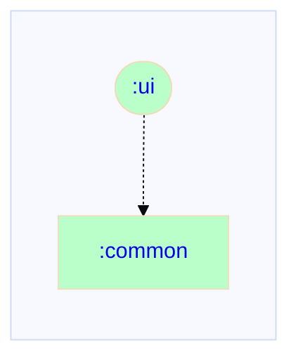

```mermaid
%%{ init: { 'theme': 'base' } }%%
graph LR;

%% Styling for module nodes by type
classDef rootNode stroke-width:4px;
classDef mppNode fill:#ffd2b3,color:#333333;
classDef andNode fill:#baffc9,color:#333333;
classDef javaNode fill:#ffb3ba,color:#333333;

%% Modules
subgraph  
  direction TB;
  :common[<a href='https://github.com/rjspies/Daedalus/blob/main/common/dependencyGraph.md' style='text-decoration:auto'>:common</a>]:::andNode;
  :ui([<a href='https://github.com/rjspies/Daedalus/blob/main/ui/dependencyGraph.md' style='text-decoration:auto'>:ui</a>]):::andNode;
end

%% Dependencies

%% Dependents
:ui-.->:common
```