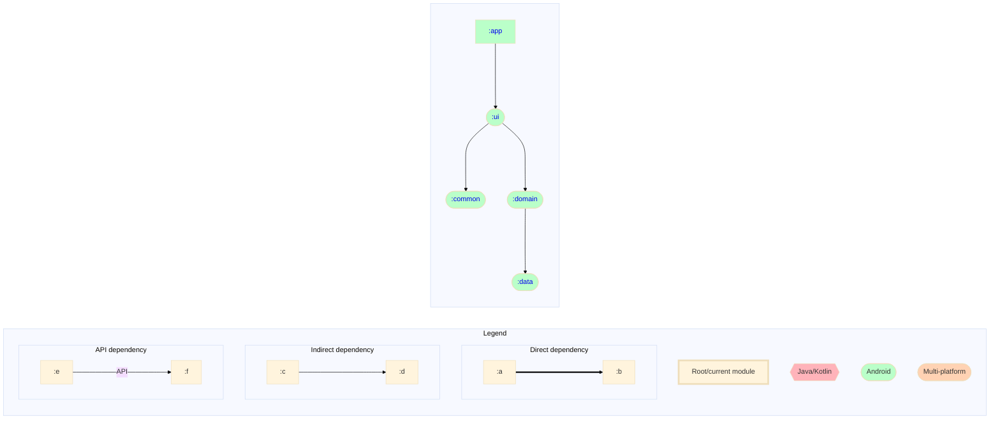

```mermaid
%%{ init: { 'theme': 'base' } }%%
graph LR;

%% Styling for module nodes by type
classDef rootNode stroke-width:4px;
classDef mppNode fill:#ffd2b3,color:#333333;
classDef andNode fill:#baffc9,color:#333333;
classDef javaNode fill:#ffb3ba,color:#333333;

%% Graph types
subgraph Legend
  direction TB;
  rootNode[Root/current module]:::rootNode;
  javaNode{{Java/Kotlin}}:::javaNode;
  andNode([Android]):::andNode;
  mppNode([Multi-platform]):::mppNode;
  subgraph Direct dependency
    direction LR;
    :a===>:b
  end
  subgraph Indirect dependency
    direction LR;
    :c--->:d
  end
  subgraph API dependency
    direction LR;
    :e--API--->:f
  end
end

%% Modules
subgraph  
  direction TB;
  :app[<a href='https://github.com/rjspies/Daedalus/blob/main/app/dependencyGraph.md' style='text-decoration:auto'>:app</a>]:::andNode;
  :common([<a href='https://github.com/rjspies/Daedalus/blob/main/common/dependencyGraph.md' style='text-decoration:auto'>:common</a>]):::andNode;
  :data([<a href='https://github.com/rjspies/Daedalus/blob/main/data/dependencyGraph.md' style='text-decoration:auto'>:data</a>]):::andNode;
  :domain([<a href='https://github.com/rjspies/Daedalus/blob/main/domain/dependencyGraph.md' style='text-decoration:auto'>:domain</a>]):::andNode;
  :ui([<a href='https://github.com/rjspies/Daedalus/blob/main/ui/dependencyGraph.md' style='text-decoration:auto'>:ui</a>]):::andNode;
end

%% Dependencies
:app--->:ui
:ui--->:common
:ui--->:domain
:domain--->:data

%% Dependents
```